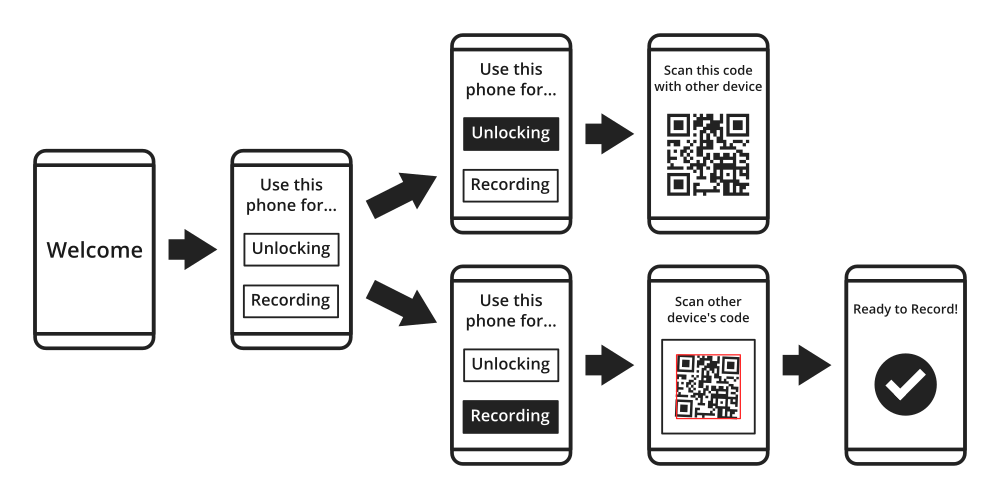

# Idea: Encrypted / Replicated Video / Audio recording app

## Motivation:

Steve has been approached by two individuals asking for an app that at first
may seem like separate ideas, but can probably be solved by a single solution.

These app ideas were to aid in protestors / activists / journalists / lawyers
gathering / recording evidence during for example a protest / recording police
brutality etc...

See:

* <https://github.com/cpunkswritecode/projects/issues/1#issuecomment-260151817>
* <https://github.com/cpunkswritecode/projects/issues/1#issuecomment-260156164>

## Requirements:

1. The video must be encrypted so that if the device is siezed, they cannot
obtain the footage that was recorded.

2. The video should be also streamed (encrypted) to an online storage location
so that if the recording device gets seized / destroyed, the footage can be
recovered.

3. The user should be able to claim deniability in knowing what the private key
is that can be used to decrypt the footage (or at least claim that they do not
have posession of a device capable of decrypting / someone else has to decrypt
it)

## Potential User Flows on First Launch:

Either of these flows could be implemented (or both). Perhaps one would work
better, this would probably require user testing to find out.

### 1. one device records, another device decrypts

Upon launching the app for the first time, the user is given two choices:

1. Use the device to **unlock** footage
2. Use the device to **record** footage.

#### Device unlocking footage:

Upon selecting this option, the device generates a random passphrase (e.g. 7
words) that it uses as seed data to generate the private key. Both are saved to
this device.

A QR code representing the public key is then displayed on this device (and can
be brought up again at any time).

#### Device recording footage

Upon selecting this option, the app will open the camera to scan the other
device's QR code, and then be ready to record footage with the given public
key.

#### Benefits

* User's can claim deniability, for example, an associate / lawyer could own
the device than can unlock the footage, and then the journalist / activist
could scan this person's device to ensure that they can claim that they cannot
unlock the footage.

### 2. single device, generated passphrase derives private key

Upon launching the device for the first time, the device will randomly generate
a pass phrase that can be used to derive a private key. This phrase is
displayed to the user, and they are asked to write it down and store it in a
safe place (perhaps multiple places).

After the user has confirmed they have done this, the device forgets the phrase
and private key, and stores the public key only. The user is then able to
record footage.

#### Benefits

* This method only requires a single device.

#### Potential Problems

* It would potentially be more easy for a user to misplace the passphrase than
it would be to misplace an "unlocking device".

## Potential Enhancements

### Add additional "unlockers"

The user could potentially choose multiple unlocking keys (recipients) to add
redundancy. For example we could allow them to scan further QR codes, or to
enter in additional passphrases, or choose from a number of pre-defined
recipients (e.g. ACLU or some other org).
